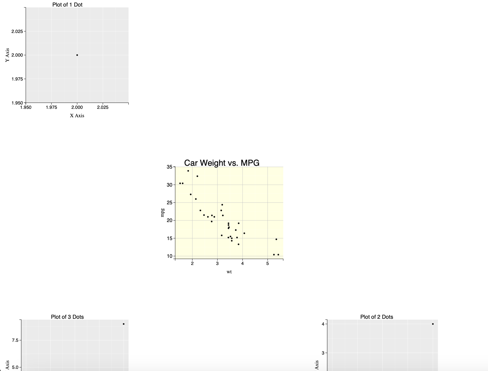
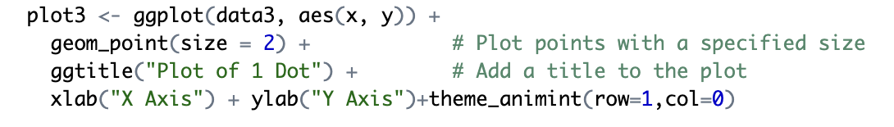

During my participation in Google Summer of Code 2024, I completed three key tasks:

1. **Migrate GitHub Actions Testing from PhantomJS to Chromote**  
   This task involved transitioning the existing test suite from PhantomJS to Chromote.
   The link to the PR is: https://github.com/animint/animint2/pull/126

2. **Implement Screenshot Functionality for Plots**  
   Added a feature to capture and save screenshots of generated plots, enhancing the ability to share and document visual data representations.
    The link to the PR is: https://github.com/animint/animint2/pull/131

4. **Add Feature for Enabling User-Defined Layout for plots**  
   Developed a feature allowing users to define custom layouts, giving them more control over the appearance and organization of their plots
   The link to the PR is: https://github.com/animint/animint2/pull/139

The detailed explanation for each of these tasks in below :

1. **Add Feature for Enabling User-Defined Layout for plots**
   ##### Screenshot of the Custom Layout of plots:
   

   The user needs to pass row and column parameters in theme_animint function to put plot in that specific location.

   ##### Passing arguments in theme_animint:
   
   
